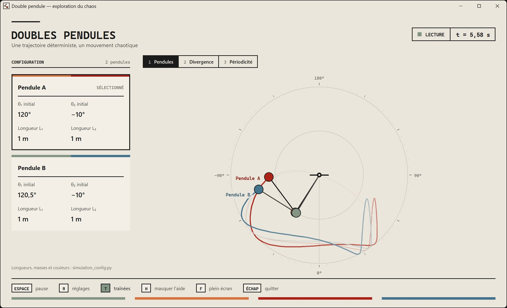
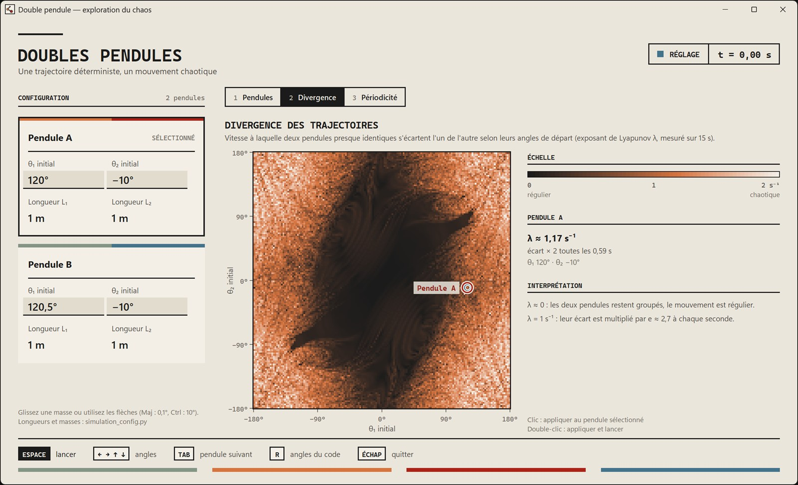
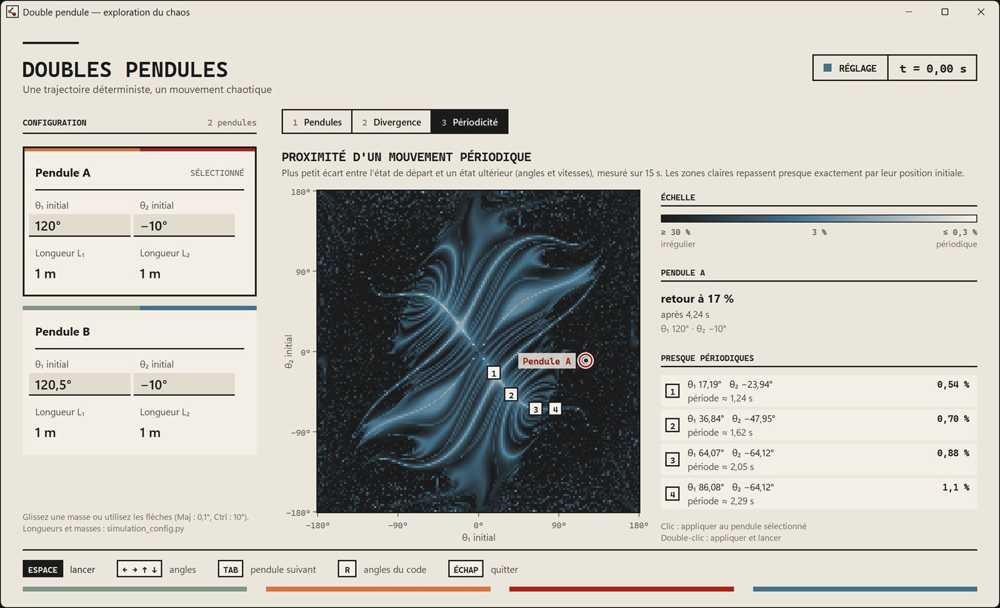

# Double pendule interactif

Application Python permettant de simuler et comparer un ou plusieurs doubles pendules plans. On choisit les angles de départ avant de lancer la simulation, puis deux cartes de chaleur aident à explorer le plan des angles initiaux : l'une mesure à quel point deux pendules presque identiques s'éloignent, l'autre repère les couples d'angles qui donnent un mouvement presque périodique.



## Installation

Il faut Python 3.11 ou plus récent, avec `tkinter` (inclus dans l'installateur Windows de [python.org](https://www.python.org/downloads/)). L'application a été développée et testée sous Windows 11 avec Python 3.14.

Depuis le dossier du projet, créez un environnement virtuel puis installez les dépendances :

```powershell
python -m venv .venv
.\.venv\Scripts\python.exe -m pip install -r requirements.txt
```

## Lancer l'application

```powershell
.\.venv\Scripts\python.exe .\main.py
```

Sous macOS ou Linux, remplacez `.\.venv\Scripts\python.exe` par `.venv/bin/python`.

L'interface n'utilise que la bibliothèque standard de Python (`tkinter`). Les cartes de chaleur demandent en plus NumPy ([`requirements.txt`](requirements.txt)) ; sans lui, l'application fonctionne mais les deux vues de cartes affichent un message d'installation.

## Déroulement

1. **Réglage.** L'application s'ouvre à t = 0, voyant « RÉGLAGE » allumé. On choisit θ₁ et θ₂ de chaque pendule :
   - en faisant glisser une masse (pas de 0,5°, 0,1° avec Maj) ;
   - avec les flèches du clavier : ← → pour θ₁, ↑ ↓ pour θ₂ (1°, 0,1° avec Maj, 10° avec Ctrl) ;
   - en cliquant sur une valeur du panneau pour la saisir (Entrée valide, Échap annule, Tab passe au champ suivant), ou avec la molette au-dessus de la valeur ;
   - en cliquant sur une carte de chaleur, ou sur un des mouvements presque périodiques proposés.

   Les modifications s'appliquent au pendule sélectionné (clic sur sa carte, ou Tab). Les angles de départ sont dessinés sur la scène.
2. **Lancement.** `Espace` démarre la simulation depuis les angles choisis (un double-clic sur une carte de chaleur fait de même).
3. **Retour au réglage.** `R` revient à t = 0 en conservant les angles choisis. En réglage, `R` rétablit les angles de `simulation_config.py`.

Seuls les angles se changent dans l'interface : longueurs, masses, gravité, amortissement et couleurs restent dans [`simulation_config.py`](simulation_config.py).

## Vues

Les onglets en haut de la scène, ou les touches `1`, `2` et `3` (ou `&`, `é`, `"` sur un clavier AZERTY, ainsi que le pavé numérique), changent de vue.

- **Pendules** : rapporteur gradué centré sur le pivot (0° correspond à la verticale descendante), traînées qui s'estompent avec le temps, masses cerclées d'encre.
- **Divergence** : pour chaque couple (θ₁, θ₂) de départ, l'exposant de Lyapunov λ mesure la vitesse à laquelle deux pendules presque identiques s'écartent : leur écart croît comme $e^{\lambda t}$. Sombre : mouvement régulier ; clair : chaotique ([détails](#4-carte-de-divergence--exposant-de-lyapunov)).
- **Périodicité** : pour chaque couple de départ, plus petit écart entre l'état initial et un état ultérieur (angles modulo 360° et vitesses), rapporté à la distance entre l'état initial et l'équilibre. Un mouvement parfaitement périodique repasse exactement par son départ. Clair : presque périodique. Les minima les plus marqués sont affinés par recherche locale, puis proposés dans une liste avec leur période ([détails](#5-carte-de-périodicité--retour-vers-létat-initial)).

<p>
  
  
</p>

Survoler une carte affiche la valeur de la cellule ; un clic applique le couple d'angles au pendule sélectionné. Chaque carte utilise les longueurs et masses du pendule sélectionné.

Les cartes sont calculées en quelques secondes sur plusieurs processus, avec NumPy, puis gardées dans le dossier `.cache/` : les ouvertures suivantes sont immédiates. Leur grille, leur durée simulée et leur pas de calcul se règlent dans `SETTINGS`. Le fonctionnement complet est décrit dans [Principes et calculs](#principes-et-calculs).

## Interface

- **En-tête** : titre, voyant réglage/lecture/pause et chronomètre de la simulation. Une notification brève y confirme certaines actions.
- **Panneau de configuration** : une carte par double pendule, avec un bandeau aux couleurs de ses deux masses, ses angles initiaux et ses longueurs. Les cartes passent en format compact lorsqu'il y a beaucoup de pendules.
- **Barre des touches** : rappel des raccourcis du mode en cours ; les bascules actives (traînées, plein écran) sont colorées.

Le style reprend celui de mon [portfolio](https://pierrehlr.github.io) : papier crème, encre, quatre couleurs mates (sauge, terracotta, rouge brique, ardoise), titres à chasse fixe en majuscules, filets d'encre et angles droits. Les polices JetBrains Mono et Inter Tight sont utilisées si elles sont installées ; sinon, Cascadia Mono et Segoe UI les remplacent.

L'affichage reste net sur les écrans haute résolution et la barre de titre prend la couleur du papier sous Windows 11. Tk ne lissant pas les formes du canvas, les éléments ronds (masses, axe, repères, icône) sont calculés pixel par pixel et encodés en PNG par [`canvas_graphics.py`](canvas_graphics.py). Les couleurs et le formatage des nombres sont regroupés dans [`theme.py`](theme.py).

## Configuration dans le code

La constante `PENDULUMS` contient tous les doubles pendules à afficher. Chaque entrée définit les masses, longueurs, angles et vitesses initiales, gravité, amortissement et couleurs. Les angles indiqués sont ceux proposés au démarrage. Ajoutez ou dupliquez une entrée pour superposer plusieurs simulations.

`SETTINGS` contrôle le pas de calcul, la vitesse de lecture, la longueur des traînées et les cartes (`map_resolution`, `map_duration`, `map_time_step`).

## Commandes

En réglage :

- `Espace` : lancer la simulation ;
- `← →` / `↑ ↓` : régler θ₁ / θ₂ du pendule sélectionné ;
- `Tab` / `Maj+Tab` : pendule suivant / précédent ;
- `R` : rétablir les angles de `simulation_config.py`.

Pendant la simulation :

- `Espace` : pause ou lecture ;
- `R` : revenir au réglage des angles ;
- `T` : afficher ou masquer les traînées.

À tout moment :

- `1`, `2`, `3` : vue des pendules, de divergence, de périodicité ;
- `H` : afficher ou masquer la barre des touches ;
- `F` : activer ou quitter le plein écran ;
- `Échap` : quitter l'application.

## Principes et calculs

### 1. Le modèle physique

Le système est formé de deux masses ponctuelles $m_1$ et $m_2$, reliées par des tiges rigides sans masse de longueurs $L_1$ et $L_2$, et suspendues à un pivot fixe. Le mouvement a lieu dans un plan vertical. Chaque angle est mesuré depuis la verticale descendante et compté positivement quand la masse est à droite de cette verticale. Avec l'axe $y$ orienté vers le bas, les positions des masses sont :

```math
x_1 = L_1\sin\theta_1,\qquad y_1 = L_1\cos\theta_1,\qquad x_2 = x_1 + L_2\sin\theta_2,\qquad y_2 = y_1 + L_2\cos\theta_2
```

L'énergie cinétique $T$ et l'énergie potentielle de pesanteur $V$ (nulle à la hauteur du pivot) valent :

```math
T = \frac12 (m_1+m_2)\,L_1^2\,\dot\theta_1^2 + \frac12\, m_2 L_2^2\,\dot\theta_2^2 + m_2 L_1 L_2\,\dot\theta_1\dot\theta_2\cos(\theta_1-\theta_2)
```

```math
V = -(m_1+m_2)\,g L_1\cos\theta_1 - m_2\, g L_2\cos\theta_2
```

Les équations de Lagrange $\frac{d}{dt}\frac{\partial \mathcal L}{\partial\dot\theta_i} - \frac{\partial \mathcal L}{\partial\theta_i} = 0$, avec $\mathcal L = T - V$, forment un système linéaire en $\ddot\theta_1$ et $\ddot\theta_2$. Une fois résolu, en notant $\Delta = \theta_1 - \theta_2$ et $D = 2m_1 + m_2 - m_2\cos 2\Delta$ :

```math
\ddot\theta_1 = \frac{-g(2m_1+m_2)\sin\theta_1 - m_2 g\sin(\theta_1-2\theta_2) - 2m_2\sin\Delta\,\big(\dot\theta_2^2 L_2 + \dot\theta_1^2 L_1\cos\Delta\big)}{L_1 D} - c\,\dot\theta_1
```

```math
\ddot\theta_2 = \frac{2\sin\Delta\,\big(\dot\theta_1^2 L_1(m_1+m_2) + g(m_1+m_2)\cos\theta_1 + \dot\theta_2^2 L_2 m_2\cos\Delta\big)}{L_2 D} - c\,\dot\theta_2
```

Le dénominateur ne s'annule jamais, car $D = 2(m_1 + m_2\sin^2\Delta) \geq 2m_1 > 0$. Le terme $-c\,\dot\theta_i$ est un amortissement visqueux simplifié, appliqué à chaque angle ; $c$ est le paramètre `damping` de la configuration, en s⁻¹. Sans amortissement ($c = 0$), l'énergie mécanique $E = T + V$ se conserve exactement. Tout le code de ce modèle se trouve dans [`double_pendulum.py`](double_pendulum.py).

### 2. Intégration numérique : Runge-Kutta d'ordre 4

L'état du système est $y = (\theta_1, \omega_1, \theta_2, \omega_2)$, avec $\omega_i = \dot\theta_i$ ; les équations précédentes s'écrivent $\dot y = f(y)$. Chaque pas de durée $h$ combine quatre évaluations de la dérivée :

```math
k_1 = f(y_n),\quad k_2 = f\big(y_n + \frac h2 k_1\big),\quad k_3 = f\big(y_n + \frac h2 k_2\big),\quad k_4 = f(y_n + h k_3),\qquad y_{n+1} = y_n + \frac h6\,(k_1 + 2k_2 + 2k_3 + k_4)
```

L'erreur commise sur une durée fixe décroît comme $h^4$ : diviser le pas par deux la rend seize fois plus petite. L'animation utilise $h = 5$ ms. Le temps réel écoulé (multiplié par `playback_speed`) est accumulé, puis consommé par pas fixes : le calcul ne dépend donc pas de la fréquence d'affichage. La traînée conserve les 220 dernières positions de la seconde masse.

### 3. Sensibilité aux conditions initiales

Le double pendule est déterministe : un état de départ donné détermine tout le mouvement. Pourtant, pour la plupart des grands angles, deux départs presque identiques mènent rapidement à des mouvements sans rapport : c'est le **chaos**. La configuration fournie le montre directement, avec deux pendules qui ne diffèrent que de 0,5° sur $\theta_1$.

Dans ce régime, l'écart $\delta$ entre les deux mouvements croît en moyenne comme $\delta(t) \approx \delta_0\,e^{\lambda t}$. Il devient de l'ordre d'un radian, c'est-à-dire que les deux mouvements n'ont plus rien de commun, au bout d'un temps :

```math
t \approx \frac{1}{\lambda}\ln\frac{1}{\delta_0}
```

Avec $\delta_0 = 0{,}5° \approx 8{,}7\cdot10^{-3}$ rad et $\lambda$ de l'ordre de 1 s⁻¹, on trouve environ 5 s, ce qu'on observe à l'écran. Diviser l'écart initial par mille ne fait gagner que $\ln(1000)/\lambda \approx 7$ s : c'est pourquoi le mouvement est imprévisible à long terme en pratique. Les erreurs d'arrondi et d'intégration sont amplifiées de la même façon : au-delà de quelques dizaines de secondes, la trajectoire calculée s'écarte de celle du système exact, même si son comportement qualitatif reste représentatif.

### 4. Carte de divergence : exposant de Lyapunov

L'exposant de Lyapunov $\lambda$ mesure ce taux d'écartement :

```math
\lambda = \lim_{t\to\infty}\,\lim_{\delta_0\to 0}\;\frac1t\,\ln\frac{\|\delta(t)\|}{\|\delta_0\|}
```

Pour mesurer un écart dans l'espace des états, il faut comparer des angles (en radians) à des vitesses angulaires (en rad/s). Les vitesses sont donc divisées par une pulsation propre $\Omega$ du système :

```math
\|\delta\| = \sqrt{\delta\theta_1^2 + \delta\theta_2^2 + \frac{\delta\omega_1^2 + \delta\omega_2^2}{\Omega^2}},\qquad \Omega = \sqrt{\frac{g}{(L_1+L_2)/2}}
```

Le calcul suit la **méthode de Benettin**, pour chaque case de la carte :

1. Un pendule « jumeau » part avec un écart $\delta_0 = 10^{-8}$, réparti également entre $\theta_1$ et $\theta_2$.
2. Toutes les $\tau = 0{,}1$ s, on mesure l'écart $d_k$ entre les deux pendules, puis on ramène le jumeau à la distance $\delta_0$ dans la même direction.
3. L'exposant est la moyenne des taux de croissance observés sur la durée $T$ :

```math
\lambda_T = \frac1T\sum_k \ln\frac{d_k}{\delta_0}
```

Cette renormalisation est indispensable. Sans elle, l'écart finirait par atteindre la taille de toute la zone accessible (les angles sont définis à un tour près et l'énergie est bornée), et le logarithme cesserait de croître. En gardant l'écart minuscule, on mesure le taux d'étirement local, sans saturation.

Avec $T = 15$ s, $\lambda_T$ est un **exposant de Lyapunov à temps fini**. Pour un mouvement régulier, l'écart ne croît qu'à peu près linéairement ; $\lambda_T$ se comporte alors comme $\ln(T)/T$ et reste faible : moins de 0,15 s⁻¹ aux petits angles. Pour un mouvement chaotique, il vaut plutôt 1 à 2 s⁻¹. Au survol, la carte affiche aussi le temps de doublement de l'écart, $t_2 = \ln 2/\lambda$. L'échelle de couleurs va de 0 au 99ᵉ centile des valeurs, arrondi au demi supérieur.

Sur la carte, la zone sombre centrale correspond aux faibles angles, donc aux faibles énergies, où le mouvement est régulier. Le chaos occupe l'extérieur, parsemé de petites zones régulières.

### 5. Carte de périodicité : retour vers l'état initial

Un mouvement est périodique de période $P$ si l'état complet se répète : $y(t + P) = y(t)$. Les pendules partent au repos, depuis $(\theta_1^0, \theta_2^0)$. Un mouvement périodique finit donc par repasser par ces mêmes angles, avec des vitesses nulles. On suit pour cela l'écart relatif à l'état de départ :

```math
r(t) = \sqrt{\frac{\mathrm{wrap}\big(\theta_1(t)-\theta_1^0\big)^2 + \mathrm{wrap}\big(\theta_2(t)-\theta_2^0\big)^2 + \big(\omega_1(t)^2+\omega_2(t)^2\big)/\Omega^2}{\mathrm{wrap}(\theta_1^0)^2 + \mathrm{wrap}(\theta_2^0)^2}}
```

- $\mathrm{wrap}$ ramène un angle dans $[-\pi, \pi[$ : un pendule qui a fait un tour complet est bien revenu à la même position.
- Le dénominateur est la distance entre l'état de départ et l'équilibre. Il rend l'écart relatif, et donc comparable entre petites et grandes amplitudes.
- Le score d'une case est le plus petit $r$ atteint pendant $T = 15$ s, compté uniquement après que le pendule s'est éloigné de son départ ($r > 0{,}5$ au moins une fois). L'instant $t^\star$ de ce meilleur retour estime la période, ou un de ses multiples.
- Le minimum tombe en général entre deux pas de calcul. On le situe précisément grâce à une parabole passant par les trois derniers échantillons $a$, $b$, $c$ de $r^2$ (avec $b$ le plus petit). Près d'un passage rapproché, $r^2$ est presque exactement quadratique, et le minimum vaut :

```math
r^2_{\min} = b - \frac{(c-a)^2}{8\,(a - 2b + c)}
```

Ce minimum est atteint à $\frac{a-c}{2(a-2b+c)}$ pas du point central.

Un mouvement périodique donne $r = 0$. Un mouvement quasi périodique, qui combine deux fréquences sans rapport rationnel, revient seulement « presque » à son départ : $r$ est petit, mais d'autant plus petit que la durée observée est longue. Un mouvement chaotique ne revient pas près de son départ, et $r$ reste grand. Quand aucun retour n'a lieu, la case est notée « aucun retour proche ».

L'échelle de couleurs est logarithmique, de 30 % (sombre) à 0,3 % (clair). L'amortissement fixe une limite inférieure : sur une période $P$, l'amplitude d'une oscillation diminue d'environ $cP/2$. Avec $c = 0{,}01$ s⁻¹ et $P \approx 2{,}6$ s, même un mode parfaitement périodique ne revient donc qu'à 1,3 % près.

### 6. Modes propres : l'origine des lignes claires

Aux petits angles, on peut remplacer $\sin\theta$ par $\theta$ et $\cos\theta$ par 1, et négliger les termes en $\dot\theta^2$. Pour deux masses et deux longueurs égales, les équations deviennent linéaires :

```math
\begin{pmatrix}2 & 1\\ 1 & 1\end{pmatrix}\begin{pmatrix}\ddot\theta_1\\ \ddot\theta_2\end{pmatrix} = -\frac gL\begin{pmatrix}2 & 0\\ 0 & 1\end{pmatrix}\begin{pmatrix}\theta_1\\ \theta_2\end{pmatrix}
```

En cherchant des solutions de la forme $\theta_i = A_i\cos(\omega t)$, on obtient deux **modes propres**, c'est-à-dire deux mouvements où les deux angles oscillent à la même fréquence :

| Mode | Forme | Pulsation | Période ($L = 1$ m, $g = 9{,}81$ m/s²) |
|---|---|---|---|
| en phase | $\theta_2 = \sqrt2\,\theta_1$ | $\omega = \sqrt{g/L}\,\sqrt{2-\sqrt2}$ | 2,62 s |
| en opposition | $\theta_2 = -\sqrt2\,\theta_1$ | $\omega = \sqrt{g/L}\,\sqrt{2+\sqrt2}$ | 1,09 s |

Lâché exactement dans l'un de ces rapports d'angles, le pendule a un mouvement périodique. Tout autre départ mélange les deux modes. Or le rapport de leurs fréquences vaut $1 + \sqrt2$, un nombre irrationnel : le mouvement est alors quasi périodique et ne repasse jamais exactement par son départ.

Sur la carte de périodicité, ces deux modes dessinent le X lumineux qui se croise à l'origine, avec des pentes $\pm\sqrt2$. Aux plus grands angles, ces familles de mouvements périodiques se prolongent en courbes : ce sont les **modes normaux non linéaires**, dont la période change avec l'amplitude. Avec la configuration fournie, les candidats proposés suivent ces courbes, par exemple $(17{,}19°, -23{,}94°)$ avec une période de 1,24 s, ou $(64{,}07°, -64{,}12°)$ avec une période de 2,05 s. Les tests vérifient que la période mesurée du mode en phase correspond à la théorie, à 0,02 s près.

### 7. Recherche des mouvements presque périodiques

Les candidats proposés à côté de la carte de périodicité sont obtenus en deux temps :

1. **Sélection sur la grille.** On retient les minima locaux de $r$, c'est-à-dire les cases plus basses que leurs 8 voisines. La carte est traitée comme un tore : $-180°$ et $180°$ sont voisins. Ces minima sont classés du meilleur au moins bon, puis on en garde au plus 6, distants d'au moins 20°. Deux départs miroirs donnent le même mouvement (voir la section 8), donc un seul des deux est conservé.
2. **Affinage.** Autour de chaque candidat, on évalue 9 départs disposés en carré 3 × 3, avec un pas initial d'une demi-case (1,125°). On se déplace vers le meilleur de ces départs ; si c'est déjà le centre, on divise le pas par deux. Après 9 itérations, les angles sont connus au centième de degré.

### 8. Calcul des cartes

Chaque carte compte 160 × 160 = 25 600 cases, et chaque case est une simulation complète de 15 s au pas de 10 ms (1 500 pas de Runge-Kutta). Plusieurs techniques rendent ce calcul rapide :

- **Symétrie miroir.** Les équations sont inchangées quand on remplace $(\theta_1, \theta_2, \omega_1, \omega_2)$ par $(-\theta_1, -\theta_2, -\omega_1, -\omega_2)$ : le départ $(-\theta_1, -\theta_2)$ donne le reflet exact du mouvement parti de $(\theta_1, \theta_2)$. Seule la moitié de la grille est donc calculée, et l'autre moitié s'en déduit. Même ainsi, les deux cartes représentent environ 58 millions de pas de Runge-Kutta.
- **Vectorisation.** Avec NumPy, toutes les cases d'un lot avancent ensemble : chaque opération porte sur des tableaux entiers au lieu d'une case à la fois.
- **Moins de fonctions trigonométriques.** Chaque évaluation de la dérivée ne calcule que $\sin$ et $\cos$ de $\theta_1$ et $\theta_2$. Les autres termes s'en déduisent par des formules d'addition : $\sin\Delta = \sin\theta_1\cos\theta_2 - \cos\theta_1\sin\theta_2$, $\sin(\theta_1 - 2\theta_2) = \sin\Delta\cos\theta_2 - \cos\Delta\sin\theta_2$ et $D = 2(m_1 + m_2\sin^2\Delta)$.
- **Parallélisme.** La demi-grille est découpée en lots d'environ 1 280 cases, répartis sur 8 processus au plus. La carte se remplit au fur et à mesure que les lots se terminent.
- **Cache.** Une carte terminée est enregistrée dans `.cache/`, sous un nom qui dépend des masses, longueurs, gravité, amortissement, résolution, durée et pas de calcul. Une carte n'est donc recalculée que si l'un de ces paramètres change.

| Paramètre | Valeur | Emplacement |
|---|---|---|
| Pas de l'animation | 5 ms | `SETTINGS.time_step` |
| Pas des cartes | 10 ms | `SETTINGS.map_time_step` |
| Durée simulée par case | 15 s | `SETTINGS.map_duration` |
| Grille | 160 × 160 (2,25° par case) | `SETTINGS.map_resolution` |
| Écart initial du jumeau | $10^{-8}$ | `chaos_maps.TWIN_OFFSET` |
| Intervalle de renormalisation | 0,1 s | `chaos_maps.RENORMALIZE_INTERVAL` |
| Seuil d'éloignement du départ | $r > 0{,}5$ | `chaos_maps.EXIT_FRACTION` |
| Candidats périodiques | 6 au plus, espacés d'au moins 20° | `chaos_maps.CANDIDATE_COUNT`, `CANDIDATE_SPACING` |

### 9. Vérifications et limites

Les tests automatiques vérifient notamment :

- la conservation de l'énergie sans amortissement : dérive relative inférieure à $10^{-7}$ sur 5 s, au pas de 1 ms ;
- l'accord entre le calcul vectorisé des cartes et le modèle de l'animation, à $10^{-10}$ près après 200 pas ;
- la symétrie miroir de l'exposant de Lyapunov ;
- un $\lambda$ faible aux petits angles et nettement positif près de la verticale ascendante ;
- la détection du mode propre en phase, avec sa période théorique ;
- le calcul complet d'une petite carte : parallélisme, symétrie et cache.

Les deux mesures ont des limites :

- **Durée finie.** Les deux mesures portent sur 15 s. Une période plus longue n'est pas détectée, et $\lambda_T$ ne vaut pas tout à fait zéro pour un mouvement régulier.
- **Résolution.** Une case couvre 2,25° : des structures plus fines peuvent passer entre les mailles. L'affinage compense ce défaut pour les candidats périodiques.
- **Amortissement.** Le terme $-c\,\dot\theta_i$ est une simplification commode, pas un modèle physique précis des frottements.

## Tests

```powershell
.\.venv\Scripts\python.exe -m unittest -v
```
